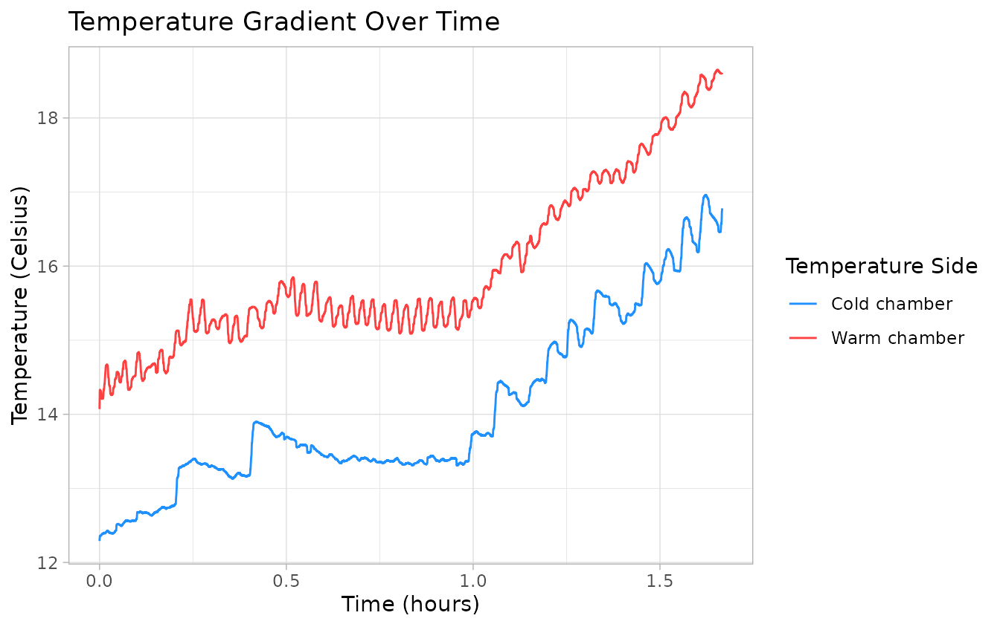
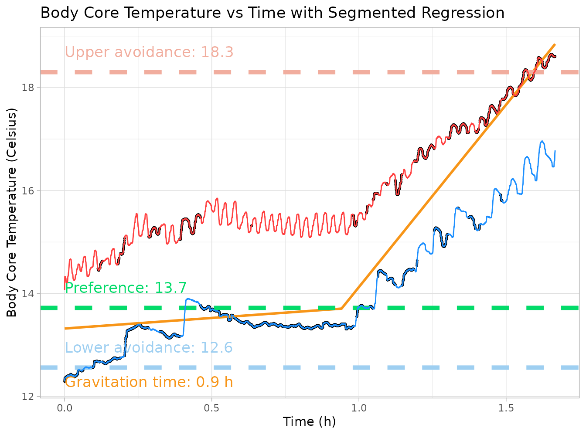
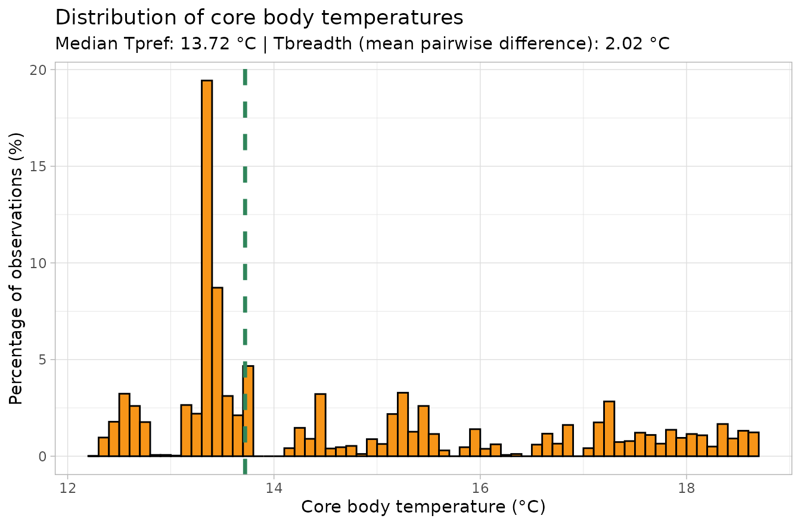
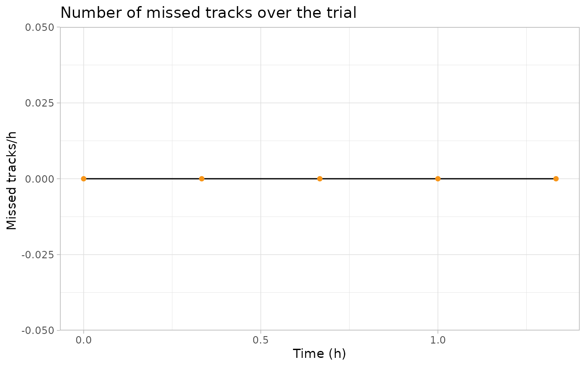
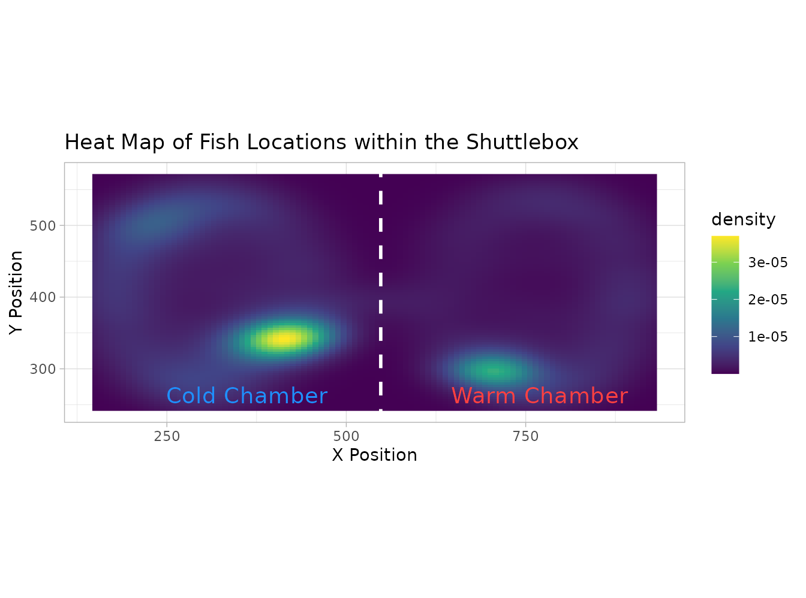
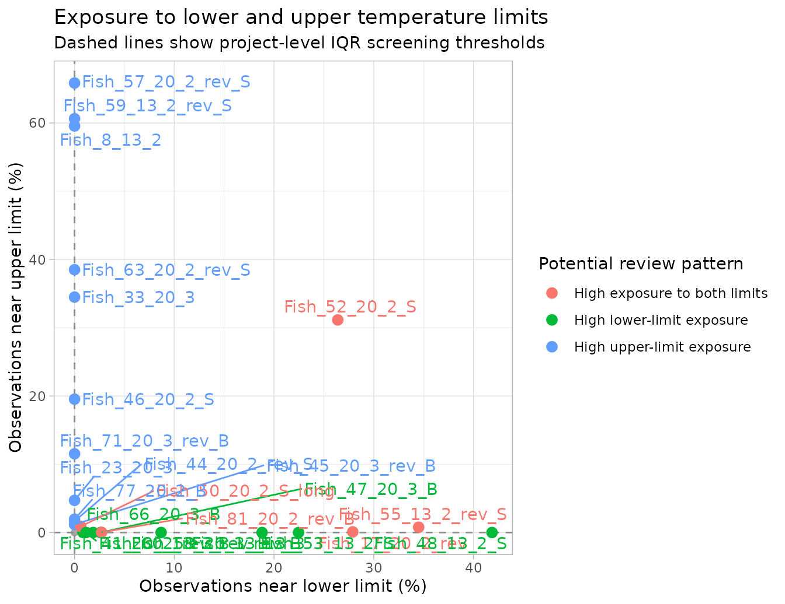
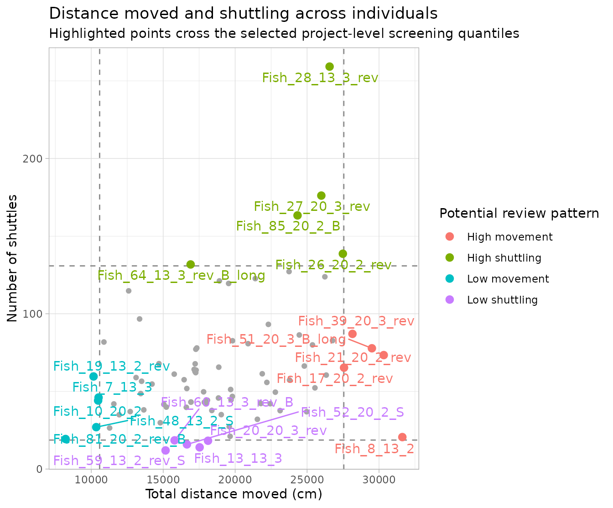
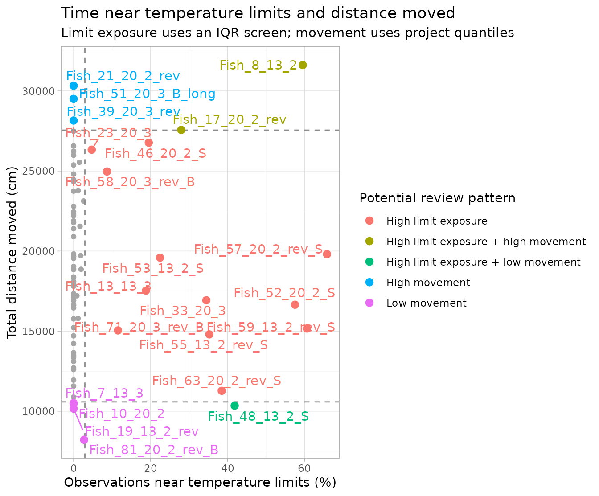
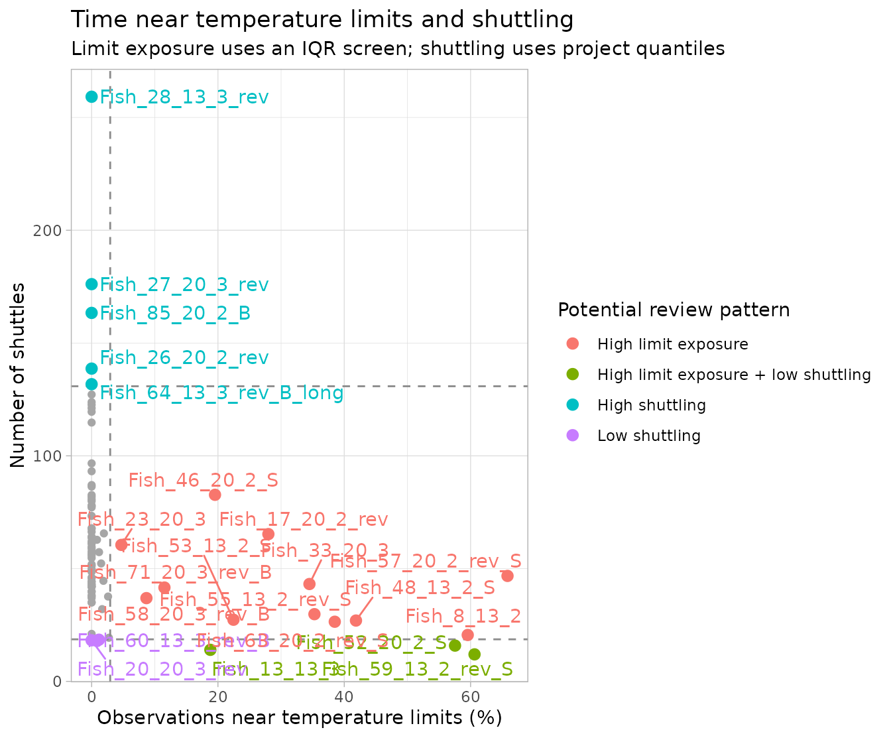
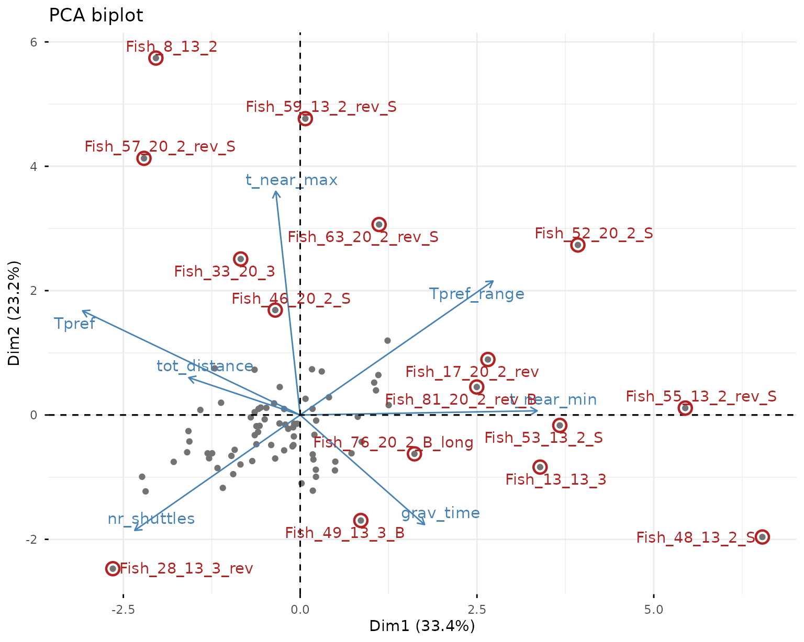

# Getting started with ShuttleboxR

### What ShuttleboxR is for

ShuttleboxR helps researchers move from raw shuttle-box recordings to a
checked, interpretable project dataset. It follows three steps:

1.  **Import and organise** the raw data.
2.  **Calculate shuttle-box metrics** consistently.
3.  **Inspect and troubleshoot** the data before formal statistical
    analysis.

The same logic operates at two linked levels:

- **Branch 1: a single trial**, used to understand one fish in detail.
- **Branch 2: the complete project**, used to compare all fish and
  identify trials that deserve closer inspection.

``` text
Raw shuttle-box recordings
        |
        +-- Branch 1: one fish
        |      import -> calculate -> inspect
        |
        +-- Branch 2: all fish
               compile metrics -> screen the project
                                      |
                                      v
                            identify fish to review
                                      |
                                      v
                         return to Branch 1 plots
```

The package does **not** automatically decide that an unusual fish
should be excluded. A project-level flag is the beginning of an
investigation, not the end of one.

``` r

library(ShuttleboxR)
```

### The inspection logic

A fish may stand out for several different reasons, and those reasons
lead to different follow-up checks.

| Project-level signal | Possible interpretation | Useful single-trial checks |
|----|----|----|
| Very low distance and very few shuttles | Inactivity, poor health, stress, tracking failure, or genuinely sedentary behaviour | [`plot_heatmap()`](https://pbriesenkamp.github.io/ShuttleboxR/reference/plot_heatmap.md), [`plot_tracking()`](https://pbriesenkamp.github.io/ShuttleboxR/reference/plot_tracking.md), [`plot_distance()`](https://pbriesenkamp.github.io/ShuttleboxR/reference/plot_distance.md) |
| Many shuttles but little total distance | Repeated doorway crossings, localised movement, or a tracking artefact | [`plot_heatmap()`](https://pbriesenkamp.github.io/ShuttleboxR/reference/plot_heatmap.md), [`animate_movements()`](https://pbriesenkamp.github.io/ShuttleboxR/reference/animate_movements.md), [`plot_tracking()`](https://pbriesenkamp.github.io/ShuttleboxR/reference/plot_tracking.md) |
| High distance and high shuttling | High activity, active thermoregulation, or possible agitation/stress | [`plot_interval()`](https://pbriesenkamp.github.io/ShuttleboxR/reference/plot_interval.md), [`plot_speed_coreT()`](https://pbriesenkamp.github.io/ShuttleboxR/reference/plot_speed_coreT.md), [`plot_heatmap()`](https://pbriesenkamp.github.io/ShuttleboxR/reference/plot_heatmap.md) |
| Substantial time near the upper limit | Preferred temperatures may exceed the programmed range, or the fish may not be regulating effectively | [`plot_T_gradient()`](https://pbriesenkamp.github.io/ShuttleboxR/reference/plot_T_gradient.md), [`plot_T_segmented()`](https://pbriesenkamp.github.io/ShuttleboxR/reference/plot_T_segmented.md), [`plot_coreT_histogram()`](https://pbriesenkamp.github.io/ShuttleboxR/reference/plot_coreT_histogram.md) |
| Substantial time near the lower limit | Preferred temperatures may fall below the programmed range, or the fish may not be regulating effectively | [`plot_T_gradient()`](https://pbriesenkamp.github.io/ShuttleboxR/reference/plot_T_gradient.md), [`plot_T_segmented()`](https://pbriesenkamp.github.io/ShuttleboxR/reference/plot_T_segmented.md), [`plot_coreT_histogram()`](https://pbriesenkamp.github.io/ShuttleboxR/reference/plot_coreT_histogram.md) |
| Multivariate PCA outlier | An unusual combination of several otherwise plausible metrics | Use PCA arrows and `outlier_details` to choose the most relevant single-trial plots |

The same pattern can have different meanings in different species. A low
number of shuttles may be normal for a sedentary species, while any
sustained exposure to a programmed safety limit is usually more
concerning. Exclusion should be based on a documented technical or
biological reason, not simply on distance from the project mean.

## Branch 1: analyse and inspect one fish

### Step 1: import and organise the recording

Select a ShuttleSoft `.txt` file or `.csv` export:

``` r

fish <- read_shuttlesoft(file.choose())
```

[`read_shuttlesoft()`](https://pbriesenkamp.github.io/ShuttleboxR/reference/read_shuttlesoft.md)
imports and prepares the recording. It creates elapsed seconds and
hours, identifies shuttle events, converts required columns to the
expected formats, and labels acclimation and trial phases when a trial
start is provided.

``` r

fish <- read_shuttlesoft(
  file.choose(),
  trial_start = "13:30:00"
)
```

When `trial_start` is omitted, the complete recording is treated as
trial data. The `core_T` values already present in the ShuttleSoft file
are retained unless the user explicitly recalculates them.

This vignette uses a shortened example recording included with the
package:

``` r

example_file <- system.file(
  "extdata",
  "Fish_8_13_3_example.csv",
  package = "ShuttleboxR"
)

fish <- read_shuttlesoft(example_file)
inspect(fish)
#> [1] "No errors were found in the dataset"
```

### Step 2: calculate the main metrics

``` r

Tpref <- calc_Tpref(fish, print_results = FALSE)
Tavoid <- calc_Tavoid(fish, print_results = FALSE)
Tpref_range <- Tavoid[2] - Tavoid[1]
Tbreadth <- calc_Tbreadth(fish, print_results = FALSE)
shuttles <- calc_shuttles(fish, print_results = FALSE)
distance <- calc_tot_distance(fish, print_results = FALSE)
tracking <- calc_track_accuracy(fish, print_results = FALSE)

single_results <- data.frame(
  metric = c(
    "Tpref (°C)",
    "Lower Tavoid (°C)",
    "Upper Tavoid (°C)",
    "Tpref range (°C)",
    "Tbreadth (°C)",
    "Number of shuttles",
    "Total distance (cm)",
    "Proportion successfully tracked"
  ),
  value = c(
    Tpref, Tavoid[1], Tavoid[2], Tpref_range,
    Tbreadth, shuttles, distance, tracking
  )
)

knitr::kable(single_results, digits = 3)
```

| metric                          |     value |
|:--------------------------------|----------:|
| Tpref (°C)                      |    13.720 |
| Lower Tavoid (°C)               |    12.560 |
| Upper Tavoid (°C)               |    18.300 |
| Tpref range (°C)                |     5.740 |
| Tbreadth (°C)                   |     2.015 |
| Number of shuttles              |    37.000 |
| Total distance (cm)             | 25630.970 |
| Proportion successfully tracked |     1.000 |

#### Tpref, avoidance temperatures and Tpref range

`Tpref` is the central selected temperature. The default calculation is
the median `core_T`, although the mean and mode are available.
`Tavoid_lower` and `Tavoid_upper` are the lower and upper percentiles of
the `core_T` distribution; the defaults are the 5th and 95th
percentiles. Their difference, `Tpref_range`, is therefore the width of
the central 90% of observations.

These metrics describe the centre and percentile boundaries of the
distribution, but they do not describe how observations are distributed
*within* those boundaries.

### What does Tbreadth mean?

`Tpref`, `Tavoid` and `Tbreadth` describe different parts of the
temperature distribution:

- `Tpref` describes **where** the distribution is centred.
- `Tavoid_lower` and `Tavoid_upper` describe percentile boundaries.
- `Tbreadth` describes **how far apart** the temperatures experienced by
  the fish were.

#### Explain it like I am five

Imagine choosing two moments from the trial and looking at the fish’s
core temperature at those moments.

- If the two temperatures are almost the same, their difference is
  small.
- If the two temperatures are far apart, their difference is large.

Now repeat this for every possible pair of moments and take the average
of all those differences. That average is `Tbreadth`.

A fish that stays at almost the same temperature will therefore have a
Tbreadth close to zero. A fish that regularly experiences temperatures
far apart will have a larger Tbreadth.

#### The equation

For core-temperature observations $`T_1, T_2, \ldots, T_n`$:

``` math
Tbreadth = \frac{1}{n^2}
\sum_{i=1}^{n}\sum_{j=1}^{n}|T_i-T_j|
```

In words, the function calculates the absolute temperature difference
for all pairs of observations and then takes their mean. This is also
known as the **Gini mean difference**. The implementation uses an
efficient equivalent calculation, so it does not need to construct an
enormous table of every pair.

#### Worked examples

| Temperature use | Tbreadth | Interpretation |
|----|---:|----|
| All observations at 20 °C | 0 °C | Every pair has the same temperature |
| 50% at 20 °C and 50% at 21 °C | 0.5 °C | Half the pairs differ by 1 °C and half by 0 °C |
| 50% at 10 °C and 50% at 20 °C | 5 °C | Half the pairs differ by 10 °C and half by 0 °C |
| 90% at 20 °C and 10% at 30 °C | 1.8 °C | The rare 30 °C observations increase breadth, but most pairs remain near 20 °C |

The 10 °C/20 °C example is important. Its Tbreadth is much larger than
that of a fish split between 20 °C and 21 °C because the two occupied
parts of the distribution are much farther apart. Unlike the previous
bin-based definition, the calculation therefore recognises the distance
between peaks.

#### What Tbreadth does not tell you

`Tbreadth` is **not centred on Tpref**. A value of 2 °C does not mean
`Tpref - 1 °C` to `Tpref + 1 °C`, and it does not define any particular
lower or upper temperature boundary.

It also cannot fully describe histogram shape. Two fish can have the
same Tbreadth even if one has a single broad peak and the other has two
separate peaks. Use the value together with
[`plot_coreT_histogram()`](https://pbriesenkamp.github.io/ShuttleboxR/reference/plot_coreT_histogram.md):

- `Tbreadth` summarises the overall spread in one number;
- the histogram shows whether that spread is narrow, broad, skewed, or
  multimodal.

`Tbreadth` is not a measure of physiological thermal tolerance.

``` r

calc_Tbreadth(
  fish,
  print_results = FALSE
)
#> [1] 2.015353
```

### Step 3: inspect whether the trial is interpretable

Inspection should answer two separate questions:

1.  Did the apparatus and tracking system work as intended?
2.  Did the fish show behaviour that can reasonably be interpreted as
    thermoregulation?

#### Chamber temperatures and system operation

``` r

plot_T_gradient(fish)
```



Look for a stable difference between the warm and cold chambers,
plausible heating and cooling rates, and no abrupt interruptions or
impossible values. A power cut or sensor failure may create a
discontinuity that is obvious here but not obvious from a single summary
metric.

#### Temperature trajectory, preference and gravitation

[`plot_T_segmented()`](https://pbriesenkamp.github.io/ShuttleboxR/reference/plot_T_segmented.md)
displays `core_T` over time together with Tpref, avoidance temperatures
and the estimated gravitation breakpoint.

``` r

segmented_plot <- tryCatch({
  invisible(capture.output(
    p_segmented <- plot_T_segmented(
      fish,
      exclude_acclimation = FALSE,
      overlay_chamber_temp = TRUE
    )
  ))
  p_segmented
}, error = function(e) {
  ggplot2::ggplot(fish, ggplot2::aes(x = time_h, y = core_T)) +
    ggplot2::geom_line() +
    ggplot2::labs(
      title = "Core body temperature through the example recording",
      subtitle = paste("Segmented fit was not estimable:", conditionMessage(e)),
      x = "Time (h)", y = "Core body temperature (°C)"
    ) +
    ggplot2::theme_light()
})
segmented_plot
```



A useful segmented plot should show a biologically plausible approach
toward a stable temperature region. Warning signs include an implausible
breakpoint, continued directional drift after the estimated gravitation
time, extended contact with system limits, or chamber temperatures that
do not respond as expected.

#### Frequency distribution and thermal breadth

``` r

plot_coreT_histogram(fish, bin_size = 0.1)
```



This plot is the visual partner to Tbreadth. Tbreadth increases when
commonly experienced temperatures are farther apart, while the histogram
reveals *why*. A narrow peak should produce a small Tbreadth. A broad
peak, long tails, or well-separated peaks can increase Tbreadth. The
same Tbreadth can nevertheless arise from different shapes, so inspect
whether the distribution is symmetrical, skewed, or multimodal. Multiple
peaks may represent distinct phases of behaviour and should be compared
with
[`plot_T_segmented()`](https://pbriesenkamp.github.io/ShuttleboxR/reference/plot_T_segmented.md)
and the full temperature-through- time record.

The `bin_size` argument here changes only how the histogram is drawn. It
no longer changes the value calculated by
[`calc_Tbreadth()`](https://pbriesenkamp.github.io/ShuttleboxR/reference/calc_Tbreadth.md).

#### Tracking and spatial behaviour

``` r

invisible(capture.output(
  tracking_plot <- plot_tracking(fish, interval_minutes = 20)
))
tracking_plot
```



``` r

plot_heatmap(fish)
```



Poor tracking can inflate or suppress distance and may create false
shuttles. A heatmap concentrated in one tiny area can indicate
inactivity, a tracking lock, or a fish that did not engage with the
thermal gradient. A broad heatmap is not automatically better: location
should be interpreted alongside chamber occupancy, shuttling,
temperature and species ecology.

## Branch 2: screen the complete project

### Step 1: compile one row of metrics per fish

Import all raw files from one folder:

``` r

all_fish <- read_shuttlesoft_project(
  directory = choose.dir()
)
```

Then calculate the same metrics for every fish:

``` r

project_results <- calc_project_results(
  all_fish,
  exclude_acclimation = TRUE,
  Tpref_method = "median",
  Tavoid_percentiles = c(0.05, 0.95)
)
```

An existing project-results CSV can be loaded directly. The package
includes an 85-fish example database:

``` r

project_file <- system.file(
  "extdata",
  "project_database_example.csv",
  package = "ShuttleboxR"
)
project_data <- read_project_database(project_file)
```

The example database predates
[`calc_Tbreadth()`](https://pbriesenkamp.github.io/ShuttleboxR/reference/calc_Tbreadth.md),
so it does not contain that metric. Tbreadth must be recalculated from
the original time-series data; it cannot be reconstructed from Tpref and
avoidance temperatures alone.

### Step 2: begin with univariate distributions

``` r

univariate_flags <- plot_histograms(project_data)
```


    #> TableGrob (3 x 2) "arrange": 6 grobs
    #>   z     cells    name           grob
    #> 1 1 (1-1,1-1) arrange gtable[layout]
    #> 2 2 (1-1,2-2) arrange gtable[layout]
    #> 3 3 (2-2,1-1) arrange gtable[layout]
    #> 4 4 (2-2,2-2) arrange gtable[layout]
    #> 5 5 (3-3,1-1) arrange gtable[layout]
    #> 6 6 (3-3,2-2) arrange gtable[layout]

The returned table identifies fish that are unusual for individual
metrics. This is useful for finding, for example, exceptionally low
distance, an unusual Tpref or substantial time near limits. A univariate
flag does not reveal whether the value is technically invalid or
biologically meaningful.

### Step 3: inspect upper and lower limit exposure separately

The combined `t_near_limits` value can conceal whether a fish repeatedly
reached the upper limit, the lower limit, or both. The separate plot is
therefore an important quality-control step.

``` r

extreme_review <- plot_upper_vs_lower_extremes(
  project_data,
  return_cases = TRUE
)
extreme_review$plot
```



``` r

knitr::kable(extreme_review$cases, digits = 2)
```

|     | fileID              | t_near_min | t_near_max | review_reason                |
|:----|:--------------------|-----------:|-----------:|:-----------------------------|
| 8   | Fish_8_13_2         |       0.00 |      59.55 | High upper-limit exposure    |
| 13  | Fish_13_13_3        |      18.80 |       0.00 | High lower-limit exposure    |
| 17  | Fish_17_20_2_rev    |      27.89 |       0.09 | High exposure to both limits |
| 23  | Fish_23_20_3        |       0.00 |       4.71 | High upper-limit exposure    |
| 33  | Fish_33_20_3        |       0.00 |      34.49 | High upper-limit exposure    |
| 41  | Fish_41_20_2_rev_B  |       0.85 |       0.00 | High lower-limit exposure    |
| 44  | Fish_44_20_2_rev_S  |       0.00 |       1.67 | High upper-limit exposure    |
| 45  | Fish_45_20_3_rev_B  |       0.00 |       1.18 | High upper-limit exposure    |
| 46  | Fish_46_20_2_S      |       0.00 |      19.54 | High upper-limit exposure    |
| 47  | Fish_47_20_3_B      |       2.60 |       0.00 | High lower-limit exposure    |
| 48  | Fish_48_13_2_S      |      41.86 |       0.00 | High lower-limit exposure    |
| 50  | Fish_50_20_2_S_long |       0.62 |       0.89 | High exposure to both limits |
| 52  | Fish_52_20_2_S      |      26.39 |      31.14 | High exposure to both limits |
| 53  | Fish_53_13_2_S      |      22.46 |       0.00 | High lower-limit exposure    |
| 55  | Fish_55_13_2_rev_S  |      34.50 |       0.78 | High exposure to both limits |
| 57  | Fish_57_20_2_rev_S  |       0.00 |      65.85 | High upper-limit exposure    |
| 58  | Fish_58_20_3_rev_B  |       8.68 |       0.00 | High lower-limit exposure    |
| 59  | Fish_59_13_2_rev_S  |       0.00 |      60.63 | High upper-limit exposure    |
| 60  | Fish_60_13_3_rev_B  |       1.15 |       0.00 | High lower-limit exposure    |
| 63  | Fish_63_20_2_rev_S  |       0.00 |      38.50 | High upper-limit exposure    |
| 66  | Fish_66_20_3_B      |       1.87 |       0.00 | High lower-limit exposure    |
| 71  | Fish_71_20_3_rev_B  |       0.00 |      11.53 | High upper-limit exposure    |
| 77  | Fish_77_20_2_B      |       0.00 |       1.94 | High upper-limit exposure    |
| 81  | Fish_81_20_2_rev_B  |       2.71 |       0.02 | High exposure to both limits |

Interpretation:

- **High upper-limit exposure:** the fish may prefer warmer conditions
  than the programmed range permits, or it may have failed to move away
  from the warm extreme.
- **High lower-limit exposure:** the analogous concern at the cold end.
- **High exposure to both limits:** may indicate unusually wide
  exploration, unstable system behaviour, tracking problems, or settings
  poorly matched to the species.

The next checks should be
[`plot_T_gradient()`](https://pbriesenkamp.github.io/ShuttleboxR/reference/plot_T_gradient.md),
[`plot_T_segmented()`](https://pbriesenkamp.github.io/ShuttleboxR/reference/plot_T_segmented.md)
and
[`plot_coreT_histogram()`](https://pbriesenkamp.github.io/ShuttleboxR/reference/plot_coreT_histogram.md)
for the flagged fish.

### Step 4: use bivariate plots to distinguish different outlier types

A bivariate plot can identify three kinds of cases:

1.  **Marginal outliers:** extreme on one axis, such as very low
    distance.
2.  **Corner cases:** extreme on both axes, such as low distance and low
    shuttling.
3.  **Unusual combinations:** values that are individually plausible but
    form an unexpected combination, such as many shuttles with little
    total movement.

The optional review guides below use the 5th and 95th project quantiles
for movement and shuttling. Time near limits is screened using
`Q3 + 1.5 × IQR`. These thresholds are transparent starting points, not
universal biological cutoffs.

#### Distance versus shuttling

``` r

distance_shuttle_review <- plot_distance_vs_shuttles(
  project_data,
  highlight_cases = TRUE,
  return_cases = TRUE
)
distance_shuttle_review$plot
```



``` r

knitr::kable(distance_shuttle_review$cases, digits = 2)
```

|     | fileID                  | tot_distance | nr_shuttles | review_reason  |
|:----|:------------------------|-------------:|------------:|:---------------|
| 7   | Fish_7_13_3             |     10507.03 |       46.05 | Low movement   |
| 8   | Fish_8_13_2             |     31620.00 |       20.58 | High movement  |
| 10  | Fish_10_20_2            |     10477.77 |       44.12 | Low movement   |
| 13  | Fish_13_13_3            |     17531.82 |       14.00 | Low shuttling  |
| 17  | Fish_17_20_2_rev        |     27567.84 |       65.30 | High movement  |
| 19  | Fish_19_13_2_rev        |     10159.01 |       59.62 | Low movement   |
| 20  | Fish_20_20_3_rev        |     18114.72 |       18.23 | Low shuttling  |
| 21  | Fish_21_20_2_rev        |     30327.36 |       73.39 | High movement  |
| 26  | Fish_26_20_2_rev        |     27485.97 |      138.66 | High shuttling |
| 27  | Fish_27_20_3_rev        |     25988.91 |      176.11 | High shuttling |
| 28  | Fish_28_13_3_rev        |     26563.92 |      259.18 | High shuttling |
| 39  | Fish_39_20_3_rev        |     28153.96 |       87.04 | High movement  |
| 48  | Fish_48_13_2_S          |     10345.62 |       26.98 | Low movement   |
| 51  | Fish_51_20_3_B_long     |     29504.34 |       77.78 | High movement  |
| 52  | Fish_52_20_2_S          |     16649.53 |       15.87 | Low shuttling  |
| 59  | Fish_59_13_2_rev_S      |     15164.25 |       11.99 | Low shuttling  |
| 60  | Fish_60_13_3_rev_B      |     15790.22 |       18.49 | Low shuttling  |
| 64  | Fish_64_13_3_rev_B_long |     16905.61 |      131.76 | High shuttling |
| 81  | Fish_81_20_2_rev_B      |      8214.46 |       19.35 | Low movement   |
| 85  | Fish_85_20_2_B          |     24335.88 |      163.36 | High shuttling |

Particularly useful patterns are:

- **Low movement + low shuttling:** inspect inactivity and tracking.
- **Low movement + high shuttling:** inspect the doorway region, false
  crossings and repeated local movement.
- **High movement + low shuttling:** the fish may be active within one
  chamber but not regulating through chamber changes.
- **High movement + high shuttling:** may represent highly active
  thermoregulation or agitation.

#### Limit exposure versus distance

``` r

limits_distance_review <- plot_limits_vs_distance(
  project_data,
  highlight_cases = TRUE,
  return_cases = TRUE
)
limits_distance_review$plot
```



A fish with **high limit exposure and low movement** may have remained
near a limit without responding. A fish with **high limit exposure and
high movement** may have been actively searching but unable to reach a
suitable temperature, which can indicate that the programmed range was
inappropriate.

#### Limit exposure versus shuttling

``` r

limits_shuttles_review <- plot_limits_vs_shuttles(
  project_data,
  highlight_cases = TRUE,
  return_cases = TRUE
)
limits_shuttles_review$plot
```



High limit exposure with few shuttles suggests little corrective
behaviour. High limit exposure with many shuttles suggests that the fish
was responding but the available gradient or limits may not have allowed
it to stabilise.

### Step 5: interpret PCA as a map of multivariate behaviour

PCA is useful when no single metric fully explains why a fish is
unusual. It compresses correlated metrics into principal components.

Use a deliberately chosen set of variables. Avoid automatically
including every numeric column, and avoid including several
mathematically redundant variables unless that redundancy is
scientifically intended.

``` r

pca_data <- project_data[c(
  "fileID",
  "Tpref",
  "Tpref_range",
  "grav_time",
  "tot_distance",
  "nr_shuttles",
  "t_near_max",
  "t_near_min"
)]

project_pca <- pca(
  pca_data,
  mahalanobis_th = 0.975,
  dbscan_th = 1,
  print_labels = FALSE,
  highlight_outliers = TRUE
)

project_pca$plots$screeplot
```


#### Reading the scree plot

The scree plot shows the percentage of total project variation
represented by each principal component. PC1 is the largest single axis
of variation, PC2 the next largest, and so on. The PC1-PC2 biplot is
only a two-dimensional view. If PC1 and PC2 explain a modest fraction of
total variation, fish can be unusual in later components even when they
do not appear extreme on the biplot.

``` r

project_pca$plots$biplot
```



#### Reading the biplot

- **Points close together** have similar combinations of metrics.
- **Points far apart** have different multivariate profiles.
- **An arrow points toward increasing values** of that metric.
- **Longer arrows** are represented more strongly in the displayed
  PC1-PC2 plane.
- **Arrows pointing in similar directions** indicate positively
  associated metrics; opposing arrows indicate negative association;
  near-right angles indicate weak association in this plane.
- A fish lying far in the direction of an arrow is likely to have a
  relatively high value for that metric. A fish in the opposite
  direction is likely to have a relatively low value.

Flagged fish are circled and labelled. The arrows suggest what to
inspect next, but `outlier_details` makes that link more explicit:

``` r

knitr::kable(project_pca$outlier_details, digits = 2)
```

| fileID | methods | mahalanobis_distance | potential_drivers |
|:---|:---|---:|:---|
| Fish_8_13_2 | Mahalanobis + DBSCAN | 23.41 | t_near_max high (4.2 SD); grav_time low (-3 SD); tot_distance high (2.4 SD) |
| Fish_28_13_3_rev | Mahalanobis + DBSCAN | 23.43 | nr_shuttles high (4.9 SD); tot_distance high (1.4 SD); Tpref_range low (-1.1 SD) |
| Fish_48_13_2_S | Mahalanobis + DBSCAN | 30.77 | t_near_min high (5.2 SD); grav_time high (3.7 SD); Tpref low (-3.2 SD) |
| Fish_49_13_3_B | Mahalanobis | 15.22 | grav_time high (3.7 SD); Tpref_range low (-0.7 SD); tot_distance low (-0.4 SD) |
| Fish_52_20_2_S | Mahalanobis + DBSCAN | 15.15 | t_near_min high (3.1 SD); Tpref_range high (3 SD); t_near_max high (2.1 SD) |
| Fish_55_13_2_rev_S | Mahalanobis + DBSCAN | 16.72 | t_near_min high (4.2 SD); Tpref_range high (2.7 SD); Tpref low (-2.4 SD) |
| Fish_57_20_2_rev_S | Mahalanobis + DBSCAN | 21.17 | t_near_max high (4.7 SD); Tpref high (2.2 SD); grav_time low (-1.2 SD) |
| Fish_59_13_2_rev_S | Mahalanobis + DBSCAN | 20.63 | t_near_max high (4.3 SD); Tpref high (2.2 SD); Tpref_range high (1.9 SD) |
| Fish_76_20_2_B_long | Mahalanobis | 14.39 | grav_time high (3.2 SD); Tpref_range high (1.4 SD); tot_distance low (-1 SD) |
| Fish_13_13_3 | DBSCAN | 9.14 | Tpref low (-3.4 SD); t_near_min high (2.2 SD); nr_shuttles low (-1.2 SD) |
| Fish_17_20_2_rev | DBSCAN | 11.71 | t_near_min high (3.3 SD); Tpref_range high (2.4 SD); tot_distance high (1.6 SD) |
| Fish_33_20_3 | DBSCAN | 6.35 | t_near_max high (2.3 SD); Tpref high (1.7 SD); nr_shuttles low (-0.5 SD) |
| Fish_46_20_2_S | DBSCAN | 6.60 | Tpref_range high (1.7 SD); tot_distance high (1.5 SD); t_near_max high (1.2 SD) |
| Fish_53_13_2_S | DBSCAN | 10.88 | Tpref low (-3.1 SD); t_near_min high (2.6 SD); Tpref_range high (1.2 SD) |
| Fish_63_20_2_rev_S | DBSCAN | 9.33 | t_near_max high (2.6 SD); Tpref_range high (2.3 SD); tot_distance low (-1.5 SD) |
| Fish_81_20_2_rev_B | DBSCAN | 5.64 | Tpref_range high (2.1 SD); tot_distance low (-2 SD); Tpref low (-1.4 SD) |

`potential_drivers` lists the original measurements that are most
unusually high or low for each flagged fish, expressed in project
standard deviations. For example, a fish driven by high `t_near_max`
should be checked for upper-limit exposure, whereas one driven by low
`tot_distance` should be checked for inactivity or poor tracking.

#### Mahalanobis distance and DBSCAN are complementary

- **Mahalanobis distance** asks whether a fish is far from the
  multivariate centre after accounting for correlations among metrics.
  It uses all retained PCA dimensions, not only the visible biplot.
- **DBSCAN** asks whether a fish lies in a locally sparse region of the
  PC1-PC2 map. It can detect isolated points even when the project
  contains more than one cluster.

Agreement between the methods is a strong reason for closer inspection,
but neither method proves invalidity. Disagreement is also informative:
a fish can be globally unusual without being locally isolated, or
locally isolated without being far from the overall centre.

The thresholds control sensitivity. A smaller `mahalanobis_th` or
`dbscan_th` will generally flag more fish. Thresholds should be reported
and, where possible, checked for robustness.

### Step 6: return flagged fish to the raw trial

``` r

fish_to_check <- all_fish[["Fish_17.txt"]]

plot_T_gradient(fish_to_check)
plot_tracking(fish_to_check)
plot_T_segmented(fish_to_check)
plot_coreT_histogram(fish_to_check)
plot_heatmap(fish_to_check)
plot_distance(fish_to_check)

calc_Tpref(fish_to_check, print_results = FALSE)
calc_Tavoid(fish_to_check, print_results = FALSE)
calc_Tbreadth(fish_to_check, print_results = FALSE)
calc_shuttles(fish_to_check, print_results = FALSE)
calc_extremes(fish_to_check, print_results = FALSE)
```

A defensible decision process is:

1.  **Flag** an unusual metric or combination of metrics.
2.  **Inspect** the original temperature, tracking and movement records.
3.  **Identify a reason**, such as a power interruption, tracking
    failure, prolonged immobility, inappropriate limits, or behaviour
    inconsistent with the intended assay.
4.  **Compare** the pattern with the rest of the project and the ecology
    of the species.
5.  **Document** whether the fish is retained, excluded, or analysed in
    a sensitivity analysis.

A fish should not be excluded merely because it is statistically
unusual. Unusual values can be genuine biological variation. Conversely,
a technically flawed trial can require exclusion even when its summary
metrics do not appear extreme.

### Getting help

Open the help page for any function with, for example:

``` r

?calc_Tbreadth
?plot_distance_vs_shuttles
?pca
```

List all package help pages with:

``` r

help(package = "ShuttleboxR")
```
