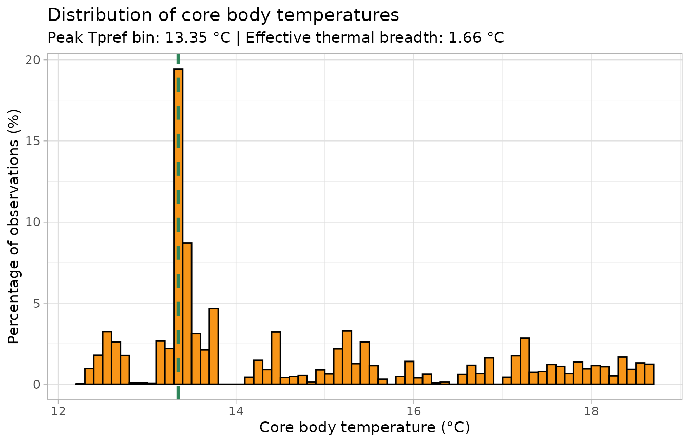
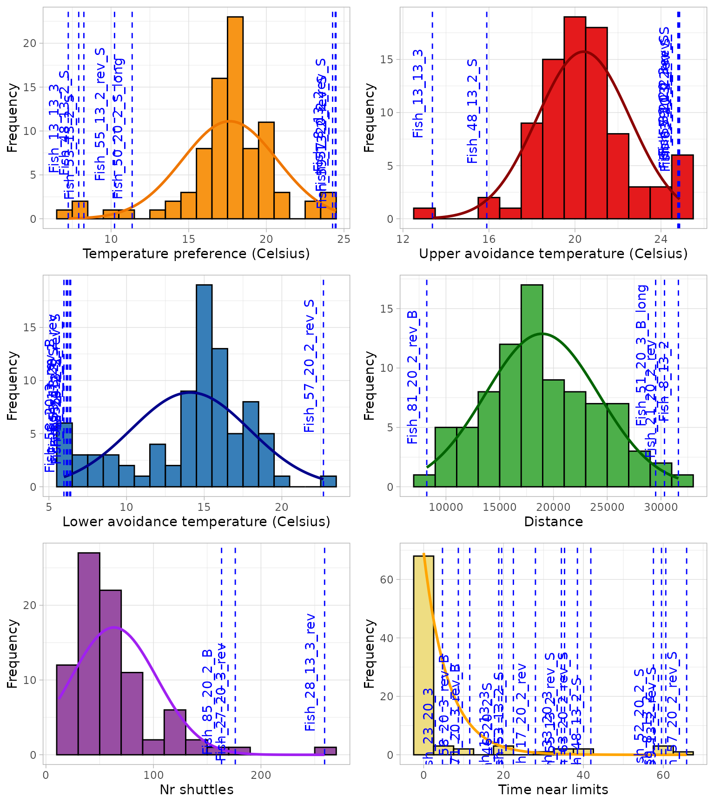
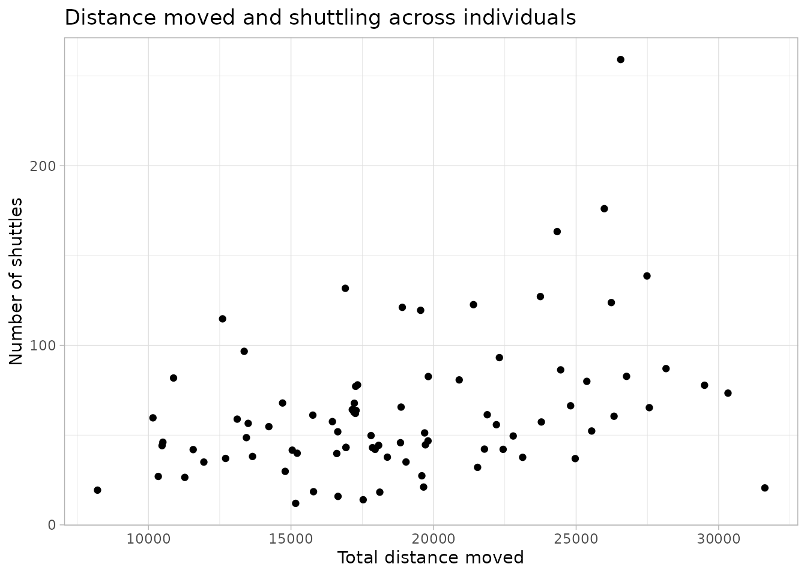
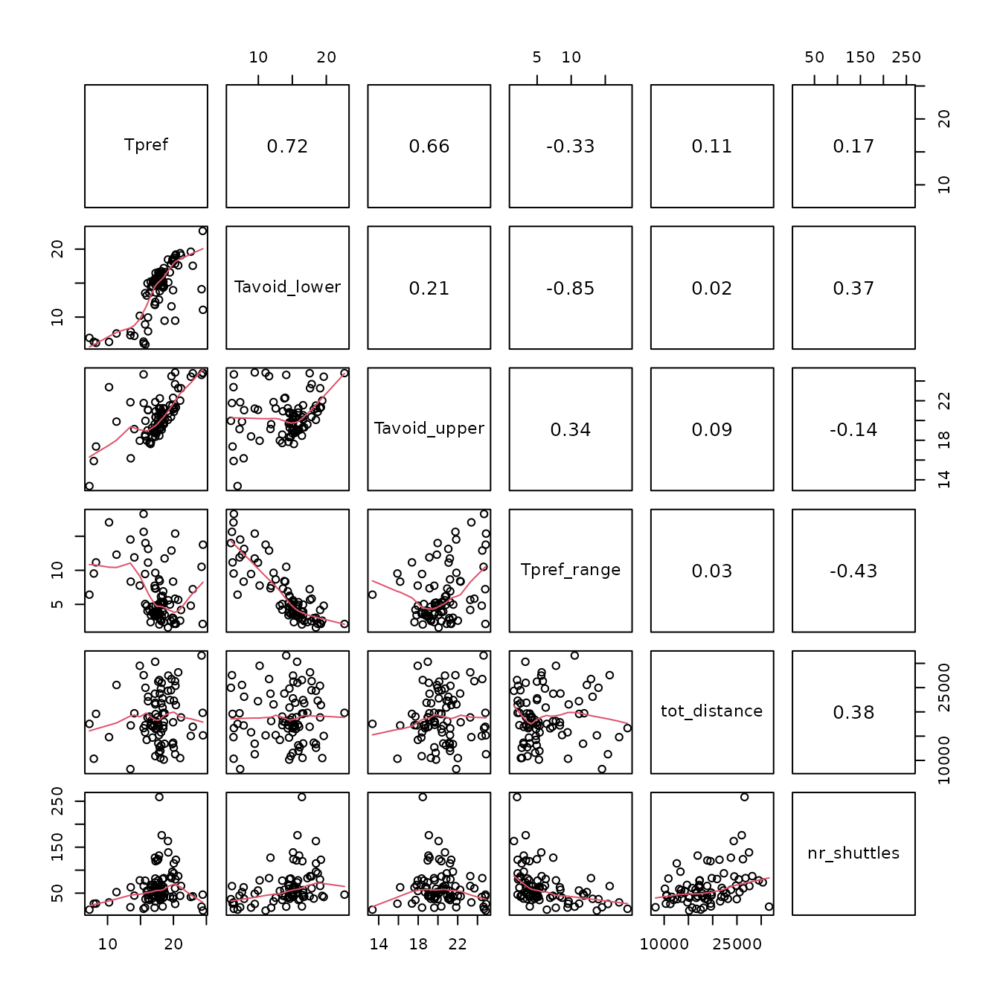
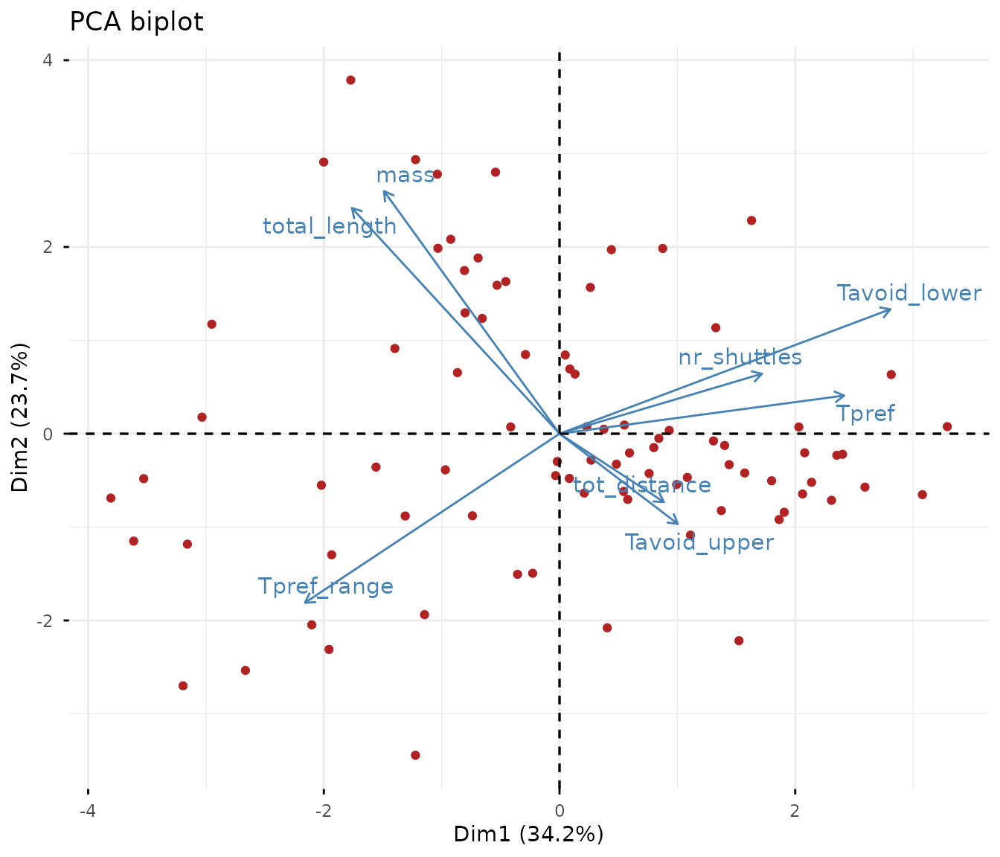

# Getting started with ShuttleboxR

## What ShuttleboxR does

ShuttleboxR provides a single workflow for moving from a raw ShuttleSoft
file to calculated thermal and behavioural metrics. It can:

- import ShuttleSoft `.txt` files and comma-separated `.csv` exports;
- label acclimation and trial periods;
- retain the `core_T` values already generated by ShuttleSoft;
- calculate thermal preference, avoidance temperatures, thermal breadth,
  shuttling, chamber occupancy, movement, and tracking quality;
- create plots for individual trials; and
- summarise all trials in a project.

``` r

library(ShuttleboxR)
#> Warning in rgl.init(initValue, onlyNULL): RGL: unable to open X11 display
#> Warning: 'rgl.init' failed, will use the null device.
#> See '?rgl.useNULL' for ways to avoid this warning.
```

## Import one file

The simplest way to import your own file is:

``` r

fish <- read_shuttlesoft(file.choose())
```

[`file.choose()`](https://rdrr.io/r/base/file.choose.html) opens an
ordinary file-selection window. The returned data are prepared
automatically, so calculation and plotting functions can be used
immediately.

This vignette uses a shortened ShuttleSoft recording included with the
package:

``` r

example_file <- system.file(
  "extdata",
  "Fish_8_13_3_example.csv",
  package = "ShuttleboxR"
)

fish <- read_shuttlesoft(example_file)
```

Check the size and first few column names:

``` r

dim(fish)
#> [1] 6000   41
head(names(fish), 12)
#>  [1] "time"         "zone"         "core_T"       "Tpref_loligo" "INCR_T"      
#>  [6] "DECR_T"       "x_pos"        "y_pos"        "velocity"     "distance"    
#> [11] "time_in_INCR" "time_in_DECR"
```

You can also run:

``` r

inspect(fish)
#> [1] "No errors were found in the dataset"
```

## Mark acclimation and trial periods

When `trial_start` is omitted, the first observation is treated as the
start of the trial and the whole recording is labelled `"trial"`.

When you know the clock time at which the experimental trial began,
provide it during import:

``` r

fish <- read_shuttlesoft(
  file.choose(),
  trial_start = "13:30:00"
)
```

Rows before that time will be labelled `"acclimation"`. You can then
exclude them consistently from calculations and plots:

``` r

calc_Tpref(fish, exclude_acclimation = TRUE)
calc_Tbreadth(fish, exclude_acclimation = TRUE)
plot_coreT_histogram(fish, exclude_acclimation = TRUE)
```

## Calculate thermal metrics

### Preferred temperature

The default estimate of preferred temperature is the median `core_T`:

``` r

Tpref <- calc_Tpref(
  fish,
  method = "median",
  print_results = FALSE
)
Tpref
#> [1] 13.72
```

The mean and unbinned mode are also available:

``` r

calc_Tpref(fish, method = "mean", print_results = FALSE)
#> [1] 14.71588
calc_Tpref(fish, method = "mode", print_results = FALSE)
#> [1] 13.37
```

### Avoidance temperatures

[`calc_Tavoid()`](https://pbriesenkamp.github.io/ShuttleboxR/reference/calc_Tavoid.md)
returns lower and upper percentiles of the observed `core_T`
distribution. The defaults are the 5th and 95th percentiles:

``` r

Tavoid <- calc_Tavoid(
  fish,
  percentiles = c(0.05, 0.95),
  print_results = FALSE
)
Tavoid
#> [1] 12.56 18.30
```

The simple central range is therefore:

``` r

Tavoid[2] - Tavoid[1]
#> [1] 5.74
```

### Effective selected thermal breadth

[`calc_Tbreadth()`](https://pbriesenkamp.github.io/ShuttleboxR/reference/calc_Tbreadth.md)
uses the complete frequency distribution rather than only its upper and
lower limits. Temperatures are divided into fixed-width bins and the
breadth is calculated as:

``` math
B_T = \frac{w}{\sum_i p_i^2},
```

where $`w`$ is the bin width and $`p_i`$ is the proportion of
observations in bin $`i`$.

``` r

Tbreadth <- calc_Tbreadth(
  fish,
  bin_size = 0.1,
  print_results = FALSE
)
Tbreadth
#> [1] 1.664842
```

The value is expressed in degrees Celsius. It becomes larger when the
animal uses a broader range of temperatures more evenly. It is a measure
of selected or experienced temperature breadth, not physiological
thermal tolerance. Always use the same `bin_size` when comparing
animals.

## Plot the temperature distribution

[`plot_coreT_histogram()`](https://pbriesenkamp.github.io/ShuttleboxR/reference/plot_coreT_histogram.md)
displays the percentage of observations within each temperature bin. The
dashed line marks the midpoint of the most frequently occupied bin, and
the subtitle reports thermal breadth calculated from the same bins.

``` r

plot_coreT_histogram(fish, bin_size = 0.1)
```



The plot is returned invisibly, so it can also be saved or altered:

``` r

p <- plot_coreT_histogram(fish)

ggplot2::ggsave(
  "core_temperature_histogram.png",
  plot = p,
  width = 7,
  height = 5
)
```

## Calculate behavioural and movement metrics

``` r

shuttles <- calc_shuttles(fish, print_results = FALSE)
occupancy <- calc_occupancy(fish, print_results = FALSE)
distance <- calc_tot_distance(fish, print_results = FALSE)
tracking <- calc_track_accuracy(fish, print_results = FALSE)

results <- data.frame(
  metric = c(
    "Preferred temperature (°C)",
    "Lower avoidance temperature (°C)",
    "Upper avoidance temperature (°C)",
    "Effective thermal breadth (°C)",
    "Number of shuttles",
    "Seconds in DECR chamber",
    "Seconds in INCR chamber",
    "Total distance (cm)",
    "Proportion tracked"
  ),
  value = c(
    Tpref,
    Tavoid[1],
    Tavoid[2],
    Tbreadth,
    shuttles,
    occupancy[1],
    occupancy[2],
    distance,
    tracking
  )
)

knitr::kable(results, digits = 3)
```

| metric                           |     value |
|:---------------------------------|----------:|
| Preferred temperature (°C)       |    13.720 |
| Lower avoidance temperature (°C) |    12.560 |
| Upper avoidance temperature (°C) |    18.300 |
| Effective thermal breadth (°C)   |     1.665 |
| Number of shuttles               |    37.000 |
| Seconds in DECR chamber          |  3852.000 |
| Seconds in INCR chamber          |  2148.000 |
| Total distance (cm)              | 25630.970 |
| Proportion tracked               |     1.000 |

Useful single-trial plots include:

``` r

plot_T_segmented(fish)
plot_T_gradient(fish)
plot_tracking(fish)
plot_heatmap(fish)
plot_distance(fish)
plot_speed_coreT(fish)
```

## Exclude time from the start or end

Most calculation and plotting functions have matching
`exclude_start_minutes` and `exclude_end_minutes` arguments. For
example, to remove the first and final 10 minutes:

``` r

calc_Tbreadth(
  fish,
  exclude_start_minutes = 10,
  exclude_end_minutes = 10,
  print_results = FALSE
)
#> [1] 1.137697
```

Use the same exclusions for every metric that you want to compare.

## Analyse a folder of files

Import every ShuttleSoft `.txt` and `.csv` file in a folder:

``` r

all_fish <- read_shuttlesoft_project(
  directory = choose.dir()
)
```

Then calculate a row of results for each trial:

``` r

project_results <- calc_project_results(
  all_fish,
  Tpref_method = "median",
  Tavoid_percentiles = c(0.05, 0.95),
  Tbreadth_bin_size = 0.1
)
```

A metadata table can still be supplied when different files have
different trial start times. It only needs the columns relevant to your
analysis:

``` r

metadata <- data.frame(
  file_name = c("Fish_1.txt", "Fish_2.txt"),
  trial_start = c("10:30:00", "14:15:00")
)

all_fish <- read_shuttlesoft_project(
  metadata = metadata,
  directory = choose.dir()
)
```

## Explore an existing project database

A project database contains one summary row per trial or individual. The
package includes an example database with 85 trials:

``` r

project_file <- system.file(
  "extdata",
  "project_database_example.csv",
  package = "ShuttleboxR"
)

project_data <- read_project_database(project_file)

dim(project_data)
#> [1] 85 14
head(project_data[c(
  "fileID", "mass", "Tpref", "Tavoid_lower", "Tavoid_upper",
  "Tpref_range", "tot_distance", "nr_shuttles"
)])
#>            fileID mass    Tpref Tavoid_lower Tavoid_upper Tpref_range
#> 1     Fish_1_13_3   30 19.84438     18.47219     21.51655    3.044359
#> 2     Fish_2_13_2   28 20.05440     18.48400     21.21841    2.734412
#> 3 Fish_3_20_3_rev   22 20.06635     18.73885     20.88207    2.143220
#> 4 Fish_4_20_3_rev   27 18.53578     17.21512     19.60535    2.390230
#> 5 Fish_5_20_2_rev   16 20.36958     19.20577     21.34257    2.136799
#> 6 Fish_6_13_3_rev   29 16.87928     15.21686     19.00942    3.792558
#>   tot_distance nr_shuttles
#> 1     13358.74    96.66285
#> 2     12599.95   114.75720
#> 3     22308.84    93.16992
#> 4     19816.90    82.61885
#> 5     21400.48   122.65630
#> 6     16928.99    43.08452
```

[`read_project_database()`](https://pbriesenkamp.github.io/ShuttleboxR/reference/read_project_database.md)
recognises names used by older ShuttleboxR versions. For example, it
automatically changes `study_ID` to `fileID`, `distance` to
`tot_distance`, and `shuttles` to `nr_shuttles`. This allows older
project results to work with the current analysis functions.

### Inspect distributions and possible outliers

[`plot_histograms()`](https://pbriesenkamp.github.io/ShuttleboxR/reference/plot_histograms.md)
displays six project-level distributions and returns a table of possible
univariate outliers:

``` r

project_outliers <- plot_histograms(
  project_data,
  id_col = "fileID"
)
```



    #> TableGrob (3 x 2) "arrange": 6 grobs
    #>   z     cells    name           grob
    #> 1 1 (1-1,1-1) arrange gtable[layout]
    #> 2 2 (1-1,2-2) arrange gtable[layout]
    #> 3 3 (2-2,1-1) arrange gtable[layout]
    #> 4 4 (2-2,2-2) arrange gtable[layout]
    #> 5 5 (3-3,1-1) arrange gtable[layout]
    #> 6 6 (3-3,2-2) arrange gtable[layout]

    head(project_outliers)
    #>   Tpref Tavoid_upper Tavoid_lower tot_distance nr_shuttles t_near_limits
    #> 1  <NA>         <NA>         <NA>         <NA>        <NA>          <NA>
    #> 2  <NA>         <NA>         <NA>         <NA>        <NA>          <NA>
    #> 3  <NA>         <NA>         <NA>         <NA>        <NA>          <NA>
    #> 4  <NA>         <NA>         <NA>         <NA>        <NA>          <NA>
    #> 5  <NA>         <NA>         <NA>         <NA>        <NA>          <NA>
    #> 6  <NA>         <NA>         <NA>         <NA>        <NA>          <NA>

### Examine relationships among metrics

``` r

plot_distance_vs_shuttles(
  project_data,
  label_points = FALSE
)
```



Related plots are available with:

``` r

plot_limits_vs_distance(project_data, label_points = FALSE)
plot_limits_vs_shuttles(project_data, label_points = FALSE)
```

A correlation matrix can be produced for any selected numeric metrics:

``` r

correlation_values <- correlation_matrix(
  project_data,
  columns = c(
    "Tpref", "Tavoid_lower", "Tavoid_upper", "Tpref_range",
    "tot_distance", "nr_shuttles"
  )
)
```



``` r


round(correlation_values, 2)
#>              Tpref Tavoid_lower Tavoid_upper Tpref_range tot_distance
#> Tpref         1.00         0.72         0.66       -0.33         0.11
#> Tavoid_lower  0.72         1.00         0.21       -0.85         0.02
#> Tavoid_upper  0.66         0.21         1.00        0.34         0.09
#> Tpref_range  -0.33        -0.85         0.34        1.00         0.03
#> tot_distance  0.11         0.02         0.09        0.03         1.00
#> nr_shuttles   0.17         0.37        -0.14       -0.43         0.38
#>              nr_shuttles
#> Tpref               0.17
#> Tavoid_lower        0.37
#> Tavoid_upper       -0.14
#> Tpref_range        -0.43
#> tot_distance        0.38
#> nr_shuttles         1.00
```

### Principal component analysis

For PCA, first select the variables that are scientifically relevant to
the question. Including every numeric column automatically is rarely
desirable.

``` r

pca_data <- project_data[c(
  "fileID", "mass", "total_length", "Tpref", "Tavoid_lower",
  "Tavoid_upper", "Tpref_range", "tot_distance", "nr_shuttles"
)]

project_pca <- pca(
  pca_data,
  print_labels = FALSE,
  var_col = "Tpref"
)
#> Warning: This FactoMineR PCA result contains only 5 eigenvalues and does not
#> include the complete spectrum. Refit the PCA with a larger `ncp` before drawing
#> a complete scree plot.

project_pca$plots$biplot
```



The other PCA outputs are available as:

``` r

project_pca$plots$screeplot
project_pca$plots$pc1contributionplot
project_pca$plots$varplot
project_pca$pca_scores
project_pca$pca_loadings
project_pca$outliers
```

The bundled example database was created before `Tbreadth` was added to
ShuttleboxR, so it does not contain that column. Thermal breadth cannot
be reconstructed from summary values alone. To add it to an existing
project, re-import the raw trial files and run
[`calc_project_results()`](https://pbriesenkamp.github.io/ShuttleboxR/reference/calc_project_results.md)
with a consistent `Tbreadth_bin_size`.

## Recalculating core temperature

Most users should retain the `core_T` column already present in the
ShuttleSoft file.
[`calc_coreT()`](https://pbriesenkamp.github.io/ShuttleboxR/reference/calc_coreT.md)
is only needed when you deliberately want to apply a separate
thermal-lag model.

``` r

fish <- calc_coreT(
  fish,
  mass = 12.4,
  a_value = 0.05,
  b_value = -0.25
)
```

The `a_value` and `b_value` coefficients cannot be estimated from the
ShuttleSoft file. They must come from an appropriate calibration or
published source.

## Common problems

**The package says that `trial_phase` is missing.** Import the file with
[`read_shuttlesoft()`](https://pbriesenkamp.github.io/ShuttleboxR/reference/read_shuttlesoft.md)
or run
[`file_prepare()`](https://pbriesenkamp.github.io/ShuttleboxR/reference/file_prepare.md)
before requesting acclimation exclusion.

**Everything is labelled as trial data.** This is expected when no
`trial_start` is supplied. Re-import the file with the actual trial
start time when acclimation needs to be removed.

**Thermal-breadth values change when `bin_size` changes.** This is
expected because the index is based on temperature bins. Choose a
biologically and instrumentally sensible bin width and keep it constant
across animals.

**The package asks for `a_value` and `b_value`.** These are only
required for optional recalculation with
[`calc_coreT()`](https://pbriesenkamp.github.io/ShuttleboxR/reference/calc_coreT.md).
They are not needed to analyse the existing `core_T` values.
